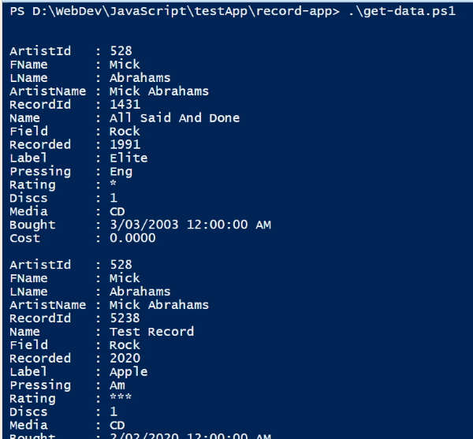
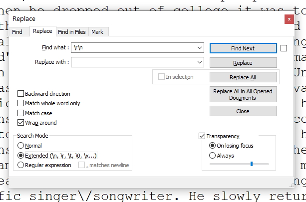
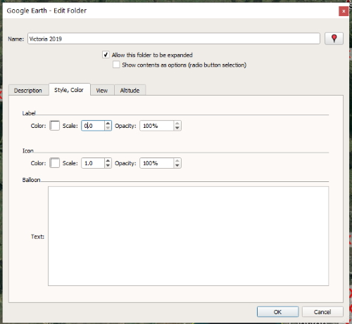
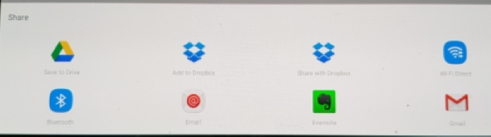
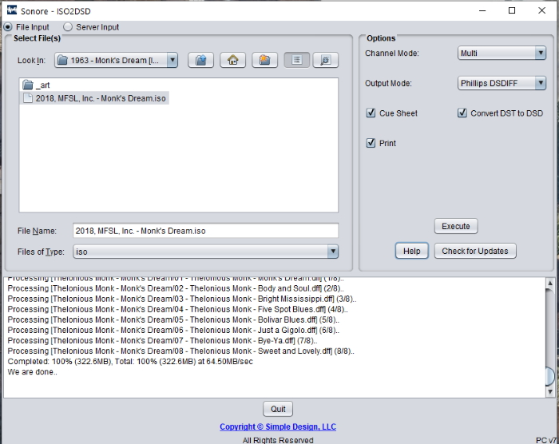

## 21-04-20

### Working with JavaScript - Variable Type errors

I was struggling to get some code working in JavaScript and realised that I'd made a small variable type error. This is one of the problems in working with a loosely typed language like JavaScript.

When I work in C# it is strongly typed meaning that I have to declare a variable and its type at the same time. This saves a multitude of errors in my code. Unfortunately I don't have this luxury with JavaScript and I have to be more careful with my variables.

##### My original code

    // get array from location.hash
    const hashArray  = function (hash) {
      const arrayValues = hash.split("-");
      return arrayValues;
    }

    const artists = getSavedArtists();

    const arr = hashArray(location.hash);

    let artistId = arr[0];
    artistId = artistId.slice(1);
    const RecordId = arr[1];

    // Find an artist
    const findArtist = function (artists, artistId) {
      return artists.find(function (item) {
        return item.artist[0].artistid === artistId;
      });
    }

I take the ``location.hash`` value from my URL, for example, **#582-432**. I split this into an array using the **-** as a separator and the first number is the *artitistId* and the last number is the *recordId*. I also need to ``slice()`` the first character off *artistId* which is the hash character.

My big mistake was that I forgot that ``split()`` only returns strings. As a result the ``findArtist()`` function wasn't returning the **artist** object.

I always use the strict equality comparison operator to do my checking.

    item.artist[0].artistid === artistId;

*item.artist[0].artistid* was a number and *artistId* was a string so the strict equality comparison wasn't finding a match.

I changed the equation to the type converting equality comparison.

    item.artist[0].artistid == artistId;

And this allowed me to find a match. It converts both variables to the same type for the comparison. This is something that is only found in JavaScript and takes a while to get used to.

Most JavaScript coders would be comfortable that the code was producing a result and leave the type conversion equality operator in place.

Coming from a strongly typed language background I find this code strange and so I decided to do the job properly and make sure the variables I created had the correct type.

    let aid = arr[0];
    aid = aid.slice(1);
    const rid = arr[1];
    const artistId = parseInt(aid);
    const recordId = parseInt(rid);

    // Find an artist
    const findArtist = function (artists, artistId) {
        return artists.find(function (item) {
            return item.artist[0].artistid === artistId;
        });
    }

I use the ``parseInt()`` function to convert my *artistId* and *recordId* variables into numbers. Now I can use the strict equality operator to do an exact match.

The other thing that I could have done to check my variable's type is to use the ``typeof()`` operator to check type.

    console.log(typeof(artistId));
    console.log(typeof(recordId));

This would tell me that both of my variables were numbers. I will make sure that I use ``typeof()`` more often when I'm coding.

## 18-04-20

### Creating a JSON file from my record list - RecordDBToJSON

Using SQL Server for generating JSON wasn't totally successful so I created a program to reformat my record list into JSON to use in my JavaScript projects. I wanted to load it into my local storage and use it as a data source.

The program I created runs in the console and has no arguments. It just grabs a dump of my Artist and Record tables and merges the two sources as a 1 *artist* to many *records* JSON file.

Creating the program was straightforward but I found the JSON still wouldn't validate due to errors in my data.

The first error was removing hard coded mdash characters from my data. The next problem was that I had to remove all linefeed / carriage return characters from my artist biographies and record reviews.

Once I completed these tasks I used JSONFormatter to validate the generated JSON and now I'm able to use the JSON file in my JavaScript projects.

## 18-04-20

### JSON tools for validating content

I have a Google Chrome extension named **JSON viewer Awesome** and was using this for testing. The problem with this extension is that it doesn't load JSON if it has validation issues. The other issue is that it doesn't show where the errors have occurred.

The following view is validated JSON.

I then changed over to using the online [JSONFormatter.org](https://jsonformatter.org/) website and was able to upload my JSON and get an error message for each place I had an issue. Unfortunately there seemed to be a lot of problems in my SQL Server formatted JSON.

I soon realised that I had issues with my artist biographies and record reviews. The main problem seemed to be that I had inserted mdash characters directly into my text and it was just a matter of replacing them with the mdash HTML entity.

JSONFormatter has a number of other useful options besides validating JSON. It can minify the JSON content and convert from JSON to XML or YAML. It can even produce a CSV from your JSON data.

## 18-04-20

### Using Powershell to create JSON from SQL Server

While searching for ways to generate JSON from SQL Server I found a video on using Powershell to generate JSON using calls to SQL Server. This looked interesting so I tried it out and it worked. Unfortunately it still didn't validate and just generated rubbish. I loaded the data into a text editor and found that when it hit the line return point it chopped data and added three dots to the end of each line.

This is the code I used to generate data from Powershell. It is just using .Net framework commands to connect to SQL Server and is not much different to the way I manipulate SQL Server from C# code.

    # Establish connection to SQL Server
    $Instance = "LION\TIGER"
    $ConnectionString = "Server=$Instance;Database=RecordDB; User Id=sa;Password=passwordhere;integrated Security=false;"

    # Main query
    $query = "SELECT a.ArtistId, a.FName, a.LName, a.Name AS ArtistName, r.RecordId,r.Name, r.Field, r.Recorded, r.Label,   r.  Pressing, r.Rating, r.Discs, r.Media, r.Bought, r.Cost FROM Artist a INNER JOIN Record r ON a.ArtistId = r.ArtistId   ORDER  BY a.LName, a.FName, r.recorded FOR JSON path, root"

    $connection = New-Object System.Data.SqlClient.SqlConnection
    $connection.ConnectionString = $ConnectionString

    $connection.Open()
    $command = $connection.CreateCommand()

    $command.CommandText = $query

    $result = $command.ExecuteReader()

    $table = New-Object "System.Data.DataTable"

    $table.Load($result)

    $table | select $table.Columns.ColumnName | ConvertTo-Json

    $connection.Close()

If I remove the JSON section from the query it just generates a dump of the data which is useful.

**Note:** before I can start working with Powershell I have to run the following command.

  Set-ExecutionPolicy -ExecutionPolicy RemoteSigned -Scope CurrentUser

I need to run the program using the following command:

  .\get-data.ps1

It needs the ``.\`` to run.

## 17-04-20

### Using SQL Server to create JSON from SQL queries

My first efforts to use SQL Server to dump SQL query data as JSON were a failure because I couldn't get the JSON to validate successfully.

When I dumped the results to the SQL Server grid view it came up with an XML error that didn't tell me much.

There were a couple of options in the Tools menu that I could change but none of these fixed the problem I had.

I then tried to dump the data into the text view and all of my data was being truncated at an arbitrary character length.

I was able to find out how to change the line length in MSSQL.

I upped the default value to 20480 characters thinking that this could help the problem but it just changed the truncation to a different position.

My next option was to save the data to a file. I still couldn't validate the JSON data but I found that if I deleted all of the line feed / carriage returns out of the data that it would work. I used the extended Find & Replace option in Notepad++ to do this.

The final results:

Once I got to this stage I realised that I had another problem. The data was just a flat table and instead of being 1 artist with many records each row repeated all of the artist's data for all of that artist's records.

This is very frustrating so I am going to write a C# program to join the data correctly.

## 16-02-20

### How to Mount exFAT Drive on Ubuntu Linux

To be able to mount exFAT filesystem on Ubuntu you'll need to install the free FUSE exFAT module and tools which provide a full-featured exFAT file system implementation for Unix-like systems.

Before installing the packages make sure the Universe repository is enabled on your system. Open your terminal either by using the Ctrl+Alt+T keyboard shortcut or by clicking on the terminal icon and type:

  sudo add-apt-repository universe

Once the repository is enabled update the packages index and install the exfat-fuse and exfat-utils packages using the following commands:

  sudo apt update 

.

  sudo apt install exfat-fuse exfat-utils

That's it! You can now open your file manager and click on the USB disk to mount it.

### Conclusion

You have learned how to enable support for the exFAT file system on your Ubuntu 18.04 machine. Some people refer to exFAT as FAT64.

The USB drive will auto mount when you insert it, but in case the auto-mount fails you will have to mount the drive manually.

## 13-02-20

### Reinstalling Linux on my ASUS E200H Notebook

Creating a new installation of Linux on my notebook is a fairly complex process so these notes describe the whole process.

I need to download the latest version of Linux Mint from the Mint website as an ISO file.

Create a boot disk on a USB using Rufus. I am using an earlier version of Rufus (v 1.31.1320) because the later versions are thought to have adware built ito them. Use the settings in the picture below.

Once you have created the boot disk put it in the notebook usb slot and also connect an external keyboard as well. The reason we do this is because the ``F2`` key on the notebook doesn't work that well (it took me hours to work this out!).

With the notebook turned off and using the external keyboard hold down the ``F2`` key and press the start button on the notebook.

This should boot into the BIOS settings on the notebook.

In the boot tab you should see the USB drive as an UEFI option. Select this option.

Now go to the Save & Exit tab and key down to the UEFI USB drive option and hit the Enter key on the external keyboard and this will reboot the notebook and boot up from the USB disk.

This sounds a silly thing to do seeing as you already set the boot option but if you don't do this you won't be able to boot from the USB. This is another thing that took me hours to learn.

You can now install Linix Mint from the USB.

In future you should be able to install a newer version of Linux Mint from the **Update** menu option in Linux Mint.

## 12-02-20

### Mounting a USB drive on Linux Mint

Mint usually works with NTFS USB drives but if you can't see the drive you can **mount** it yourself.

First run the command to see your hardware devices.

  sudo fdisk -l

At the Disk line

> Disk /dev/sdb: 8004 Mb 8004304896 Bytes

This is the usb disk drive

At the Device Boot line you should see something like:

> **Device   Boot Start		End		Blocks	   Id	System**
> /dev/sdb1 *		32	  1234567	1234567		7	HPFS/NTFS/exFAT

This will be another reference to the  usb drive. The **sdb1** reference is more specific and the one we will use.

We use **fdisk** to confirm the name of the USB hard disk.

We now need to create a folder so we can mount this disk.

  sudo mkdir /media/usb
	
This will create a folder for us to use.

Finally we need to mount the disk with:

  sudo mount /dev/sdb1 /media/usb

mount the darware location **/dev/sdb1** in the software location **/media/usb**.

Now if this has worked correctly you should see your USB disk pop up on the screen and you now have access to the USB.

## 29-12-19

### Working with KMZ files in Google Earth

I use **Google Earth** to show all of the location points that I have created. The reason for this is that it doesn't have the limitation of maximum number of points that Google maps has. I can drag a **.kmz** file onto the desktop in Google Earth and it will load the points and show them on the maps.

Initially when I did this it showed me nice icons and there were no placemark names appearing on the screen. Lately it hasn't been showing the correct icons and it lists all of the placemark names making for some ugly viewing.

I have been able to change the map to show a much less cluttered view of my location data.

#### Remove the placemark names

This is what my screen looks like.

To remove the placemark names I can go to the properties view in my bookmark set.

In the dialog box I need to change the **Label** in the *Style, Color* tab to a scale of **0.0**. This shrinks the name to nothing.

Now it looks much better with the names removed so next we will change the icons.

#### Location icons

I have to modify my **.kml** file to show Google icons as the original Maps.me icons don't show anymore.

The original style for a red placemark is shown below:

    

This doesn't work anymore so I have changed this to:

    

This image shows the final results:

## 29-12-19

### Working with KMZ files in Maps.me

**Note:** all screenshots were taken from my Samsung tablet.

I have been saving my location points to **Maps.me** when we travel using my Samsung tablet. As I only download the points once a year it is very easy to forget the method I use to export my points.

Each year I create a new bookmark set, for example this year I created a set named *Victoria-2019* and this is where I saved all of my local points. I can download these points by opening the bookmark set that I want to export.

In *Maps.me* I can click on the bookmarks icon:

This opens a list of all my bookmark sets.

The set I want to export is *Victoria-2019* so I click on that set and it opens up a list of all of my location points.

On the top right hand side of this page is the export icon:

Click on this and it will give you a list of places you can export to.

In my case I want to export to Google Drive so I click on the icon.

By clicking on *Save* it will export to my Google Drive folder.

**Note:** I need to save the set as a **.kmz** file. This is a compressed zip file that I can open later and it contains a **.kml** file that is an *xml* file that I can edit if I need to.

I have now backed up up all of the saved *Maps.me* points to my computer.

----

## 21-11-19

### Changing the **Link** program to download a Web Request

My *Link*, *Packt* and *Plural* programs have been set up to manually get a webpage and this is a slow process.

I have updated the **Link** program to pass in a URL as an argument and then download and create the page automatically. This saves me a boring task.

The program update was more complex than I originally thought because the pages I was trying to download used a network security protocol so I was getting TLS security failure exceptions. My Original WebRequest code that I have used for years works on most websites but failed on LinkedIn and Pluralsight. To make matters worse when I fixed the LinkedIn issue it wouldn't work with the Pluralsight URL's. I now have it so that I can download webpages from all three websites with the same set of code.

----

## 17-11-19

### Renumbering training and music files - Num

Following on from my directory renaming program I have written some more code to renumber my video training and music files. Once again this is something that I have been doing for years and should have automated as some of the training materials can take around 10 to 45 minutes of manual work. I have a backlog of files that I wasn't going to finish so I had to come up with a better way of doing the task.

I have been using the program for a couple of weeks now and have been able to clear around 150 folders of training materials so I am ecstatic at the amount of time I have saved. While there are still some folders that require manual intervention I have cut down my times on average to around 1-2 minutes per training course.

The folders of material I have to renumber have never been in a consistent format so I have had to program for a number of different formats. I have also written three other programs to download "table of contents" from various training sites to help with renumbering files that have inconsistently numbered files that require manual intervention. I will now describe how these programs work and the workflow I use to complete my work.

If the directory structure for the training materials isn't consistent I will rename the folders using the **DList** program. This tries to rename the folders and creates a batch file that I can use to manually change the folder structure if needed.

I then run the **Num** program with a number of switches depending on the files I am trying to renumber.

``-s`` is used to renumber the files in all sub folders. Leaving this off will only renumber the files in the current directory.

``-w`` states that I don't want to check what I am renumbering and just renumbers the files. In either case it will produce a log file that details the name changes that will take place.

``-b`` is used for music files that have comments in the music track names. I don't want to see these as they are also added to the Id tags within the track itself.

If there are training materials that require more intervention I will use the following programs to help me with the renumbering.

**Link** retrieves a "table of contents" listing for training materials from LinkedIn (previously Lynda.com). It requires the name of a text file with the contents of the web page for the training materials. At present I am manually saving the page and adding it to the root directory of the training materials. I will automate this process in the future by just getting the URL to the training materials and then using my program to download the content. This will save me doing the manual process of getting the page content.

**Plural** retrieves the page content for Pluralsight training files.

**Packt** retrieves the content from the Packtpub website.

#### Notes

The **Num** program is consistent in most cases but there are times when a quick eyeball of the directory content can be helpful. The program works on the assumption that everything to the left of the first space character is part of a number prefix. If a file name doesn't start with a number then I will ignore that file.

If a file name has a number after the first space character then my coding doesn't work as anticipated.

for example this file will be renumbered correctly from:

    1. This Is My Music File.flac

To:

    01 - This Is My Music File.flac

This file will need to be manually fixed.

    1. 12 Tons Of Steel.flac

would be renamed to:

    112 - Tons Of Steel.flac

This situation doesn't come up that often so it isn't a big issue.

----

## 26-10-19

### Renaming directories - DList

I often have to rename directories in the training materials that I download. They never seem to have a consistent file structure so I manually create a batch file to rename the directories. This takes me around 2-3 minutes each time I do it and I find that I am constantly creating batch files to do this task.

Today I spent around 2 hours to automate this process and have run the program on a number of directories to test that it works correctly. It has cut my time down to around 10 seconds for each set of training materials.

I am shocked that I never thought to automate this task before and am pleased that it will save me from some redundant work. At present I am creating a batch file to carry out the task rather that automate the process of renaming the directories. There is the occasional set of folders that will need some manual intervention and this can be done in around 30 seconds.

My next task will be to rename the video files in the sub-directories as this process is very labour intensive and varies depending on the number of subdirectories I have to rename.

----

## 21-10-19

### Displaying Markdown files

I am currently creating all of my documentation in Markdown format and then converting to HTML with *dillinger.io* for viewing. I had a Visual Studio extension that could do this but every time I saved a page edit it would shift focus from Visual Studio to Chrome and that was very disconcerting. I disabled that extension.

I always seem to have a lot of typos and would like a method of viewing my Markdown files before converting them to HTML. If I find errors I have to edit them in Markdown and HTML which is painful. I did a search for Markdown viewers and found a Chrome extension named *Markdown Reader*. I have installed this and it works really well. All I do is drop my ``.md`` file onto a Chrome browser page and it displays in HTML.

The only setting I have to change to get it working is open the extension and turn *Allow access to file URLs* on.

I opened this diary page in the Markdown reader and was pleasantly surprised. On the right-hand side of the screen there was a table of contents that allowed me to select an item from the posts I have created. This is really handy as the number of items I have added is growing quickly.

It also updates the HTML page as I continue typing in my Markdown file which is another nice feature. I can switch between Visual Studio Code and the browser when I like rather than have the VS Code extension force me to view the page update every time the page is saved.

----

## 20-10-19

### Converting music files

I have been searching for a musical holy grail for a number of years (well what I would call a holy grail). Converting music files from one format to another is something I have been doing for years but I have always had trouble reformatting ``.iso`` files into high quality FLAC files.

I recently downloaded a Thelonious Monk album in ``.iso`` format and tried to load it into *Foobar 2000*, my music player of choice. It wouldn't play so I did a search for ``.iso`` to Flac converters. The first thing I found was a way to play ``.iso`` files in *Foobar 2000*. There are a couple of Foobar components that can be downloaded from Sourceforge that will allow me to play ``.iso`` files.

[Sourceforge.net](https://sourceforge.net/projects/sacddecoder/files/foo_dsd_asio/)

I installed the two components, **foo_input_sacd.fb2k** and **foo_dsd_processor.fb2k** and was able to play my ``.iso`` file in Foobar. I am also able to convert the individual ``.iso`` tracks into Flack format and got really excited until I realised they were only 44 Mhz tracks, not the 88 Mhz SACD format files.

I could stop right there and be happy that I can play ``.iso`` files but there is a hard disk hit with the size of the ``.iso`` file at 1.8 Gb which brings me back to why I want to compress the tracks to high quality compressed Flac files.

Some more reading had me downloading another open source utility named **Sonore**, a Java based GUI that converts the ``.iso`` file into individual Phillips format ``DDISDFF`` tracks. It is nice to create individual tracks that can also be played in Foobar but once again I am hit with 1.8 Gb of files.

This is the Sonore interface with the settings I use to create ``.dff`` files:

I have found one method of converting from ``.dff`` to high quality Flac that works really well but unfortunately it is not freeware and is priced at $116 US and that is too much in my book.

I am back a square one with no method of converting to Flac but at least I can play ``.iso`` files in Foobar for the time being.

----

## 19-10-19

### Localhost issue

Today I was setting up a new project to use *127.0.0.1:3000* and when I went to run the development server I got an error stating that the port was in use.

The strange thing was that I had been using port 3000 about two days previously. I can't be sure if my PC had been turned off during that period. I have to assume that it hadn't been turned off.

I did a quick Google search and good old Stack Overflow came to the rescue with the following fix.

    netstat -ano | findstr :3000

Will tell me of the port 3000 is being used. It produced the following results:

    TCP    0.0.0.0:3000           0.0.0.0:0              LISTENING       7108
    TCP    [::]:3000              [::]:0                 LISTENING       7108

The way to stop the process is to use the command *tskill* with the PID of the process that is running. In my case:

    tskill 7108

This stopped the process and I was able to run my current dev server. This will be handy for future development.

----

## 16-10-19

### Renamer project

I downloaded some files recently and every file contained a prefix with the website's name in it. This included all of the source code files which rendered the code useless.

I tried using my **Name** utility program to remove the offending phrase but it ended up changing the names of some files. I need to remove the prefix without changing the rest of the filename. My first option was to search the web for a free file renaming program. All I found was a program that you had to pay for or a very complicated utility with a million options for renaming files that I didn't need.

In the end it was easier to create my own utility to perform the task. I used the basic code from the **Names** program and took out all of the name changing options and just allowed it to remove a particular phrase.

The utility has an option to work on the current directory or all directories. It can also produce a report of the changes to be made before changing the actual filenames.

----

## 05-10-19

### Learning about the Babel process

In the last couple of days I have been watching videos on how to use Babel in my workflow.

I have conflicting feelings on why I need to bother with Babel but am prepared to use it. The reason projects like Babel and Webpack came about is because web browsers are not keeping up with JavaScript development. There have been a number of updates to JavaScript and each browser seems to implement the new features in different timeframes.

Some browsers like Internet Explorer and Apple Safari are way behind in adopting the new features of JavaScript. I have tried using ``let`` with Safari and it failed so I need to dumb down to using ``var`` instead. Internet Explorer is worse as it has no provision for classes which are an essential part of JavaScript programming.

The new features are well worth using and provide a lot of functionality in JavaScript programming. The way around this conundrum is to transpile your code to older versions of JavaScript so they can reach web browsers without the latest JavaScript features.

Developers have come up with Babel and Webpack to allow you to do this. To use these tools you have to change your workflows and configuration and this is why I have been learning about these new tools. Surprisingly Microsoft products have also been changing their directory structures and the latest version of ASP.Net core has a very similar structure to what I am learning about with Babel and Webpack.

----

## 27-09-19

### JavaScript Training

I have recently completed the Udemy Modern JavaScript Bootcamp 2019 course run by Andrew Mead. It has been one of the most professional courses I have taken in video training. The quality and depth of training would be enough to give a learner a solid understanding of javascript. There is enough content to keep a user going for a couple of months.

I did all of the training exercises and have built up a wealth of knowledge and some best practices in JavaScript. I didn't take any notes while I was training and kept the source code as my notes. The main reason for this was that Andrew created a PDF booklet based on all of the training that he presented in his videos.

I am now realising that I went through the course too quickly and regretting that I didn't create my usual Markdown notes so I am going to start going through select modules and create some documentation. I will also use Andrew's notes to complement mine.

I will start with the module on JavaScript dates. Andrew noted that dates in JavaScript are basic and used the third party Moment.js library to extend the JavaScript date functions.

----

## 27-09-19

### Using Git

I have spent the past week re-investigating Git for source control in my programming projects. Previously I used   Azure DevOps (formerly Team Foundation Server or TFS) for source control. I am happy with TFS but wanted to use Git as there are millions of other users posting their projects on Github. The thing that put me off putting my projects on Github is that they are public and anyone can see them. For most of my code this wouldn't bother me but there are certain projects that I would want to keep hidden.

It dawned on me that I could use Git with Azure DevOps instead of using Github. This keeps my projects hidden and to do the same on Github would cost me around $10 Au with a limit of 5 repositories.

I have been learning Git through some video training and am surprised at how easy it is to set up a Git project. I am using the Git bash shell to do my commits and really like bash as a command line environment. It is also easy to push my projects to Azure DevOps and store them in a remote repository reducing the risk of losing my source code. The nice thing about Azure DevOps is that I can use the sprint and backlog boards to scope out my projects. Each backlog has a unique Id that I can use in my Git messages to relate the commit to my backlog or sprint item.

Previously I was keeping my source code in TFS and was happy doing this but it is more complicated to set up a repository and I had occasional issues with TFS.

I keep on forgetting where Azure DevOps keeps the links for new repositories I create so I am writing notes on the process. I have created a new local repository named Notes. I then created a repository in Azure DevOps to store a remote version of the Notes repository.

You can find the Azure Devops repository links in *Repos -> Pushes*.

    git remote add origin https://alanr.visualstudio.com/Notes/_git/Notes

    git push -u origin --all

----

## 26-09-19

### Build a new template for my documents

I write a fair number of documents in Markdown format with the intention of eventually getting the notes into HTML format so that I can view them in a browser. I have been using Bootstrap 3 as a template for my pages to make them a bit more user friendly.

Today I decided that it was about time to update my template into Bootstrap 4. I have been using Bootstrap 4 for my web projects and like the nice modern flat button format and am interested to see how my notes would look in this format.

It took me about an hour to format my notes into Bootstrap 4 and I am happy with the results. I have used the Cosmo theme by Thomas Park. You can download this free theme from [bootswatch.com](https://bootswatch.com//).

I have reformatted my Git training notes with the new template.

----

## 25-09-19

### First diary note

I am going to keep a diary of the programming work that I do on my computer. This will give me an idea on how I am progressing with my learning and the projects that I am building.

I may also write random music notes and other thoughts as well. The idea is not to publish these notes as a blog but in future that might change.
